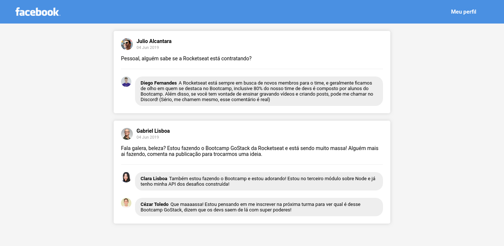

<h1 align=center>Desafio 04</h1>

<h2>Propósito</h2>

Desenvolver uma página estática como clone da listagem de posts do Facebook, para fixação de conteúdo, utilizando componentes, propriedades, css e imagens.

